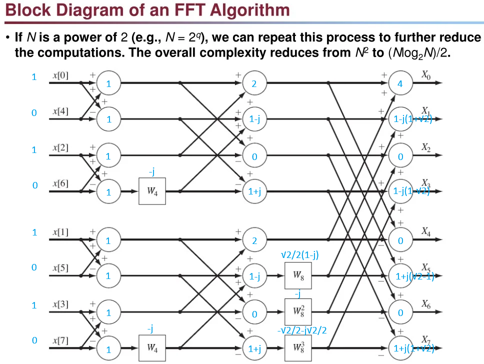

FFT (Fast Fourier Transform) is just a **faster** way to calculate the DFT.

Suppose we have 8 samples: $x[0], x[1], x[2], x[3], x[4], x[5], x[6], x[7]$

The DFT computes: $X[k]=\sum_{n=0}^{N-1} x[n] e^{-j2\pi kn/N}$ for $k=0,1,\dots,N-1$

Each $X[k]$ tells us: "How strong is frequency $k$?"

# The problem with DFT
For each $X[k]$: $N$ multiplications are needed.

And there are $N$ different $X[k]$.

Therefore: $N^2$ operations.

For example:

- $N=8$ → $64$ operations
- $N=1024$ → about $1,000,000$ operations
- $N=1,000,000$ → impossible to do quickly

# FFT idea

FFT noticed that the DFT contains many **repeated calculations**.

Instead of computing everything separately, FFT:

- Splits the signal into smaller pieces
- Reuses intermediate results
- Combines them cleverly

This reduces complexity from $N^2$ to $N \log_2 N$, which is dramatically faster.

## Why it works

Remember: $e^{-j2\pi (k)(n)/N}$ is periodic.

Many terms used in the DFT are identical.

FFT exploits these symmetries instead of recomputing them.

# Example: 8-point FFT



We'll use the simplest possible signal: $x[n] = [1,1,1,1,0,0,0,0]$

The goal is to compute the 8-point DFT: $X[k]=\sum_{n=0}^{7} x[n]W_8^{kn}$​ where $W_8=e^{-j2\pi/8}$

Instead of directly computing 8 DFT outputs, FFT repeatedly splits the problem into smaller DFTs.

## Step 1: Split into even and odd samples
Take even indices:
```
x_even = [x0,x2,x4,x6]
       = [1,1,0,0]
```
Take odd indices:
```
x_odd  = [x1,x3,x5,x7]
       = [1,1,0,0]
```
Now we have transformed one 8-point DFT into two 4-point DFTs.
```
8-point
   |
+-----+
|     |
even  odd
4pt   4pt
```

## Step 2: Split again
For the even branch:
```
[1,1,0,0]
```
Even positions:
```
[1,0]
```
Odd positions:
```
[1,0]
```
Similarly for the odd branch:
```
[1,0]
[1,0]
```
Now everything is reduced to 2-point DFTs.
```
8pt
 |
 +-4pt
 |  |
 |  +-2pt
 |  +-2pt
 |
 +-4pt
    |
    +-2pt
    +-2pt
```

## Step 3: Compute the 2-point DFTs
For a sequence: $[a,b]$

the 2-point DFT is:

$X[0]=a+b$ 

$X[1]=a-b$

For $[1,0]$

we get: $[1,1]$

So every 2-point block becomes:
```
[1,0]
   ↓
[1,1]
```

## Step 4: Combine into 4-point FFTs
Take one of the 4-point branches.

We have:
```
Top  = [1,1]
Bottom = [1,1]
```
FFT combines them using:

$X[k]=E[k]+W_4^k O[k]$ 

$X[k+2]=E[k]-W_4^k O[k]$

where

- $E[k]$ = even FFT result
- $O[k]$ = odd FFT result

### k = 0
$W_4^0=1$

$X[0]=1+1=2$  

$X[2]=1-1=0$

### k = 1
$W_4=e^{-j\pi/2}=-j$ 

$X[1]=1+(-j)(1) =1-j$

$X[3]=1-(-j)(1) =1+j$

Thus: $[2, 1-j, 0, 1+j]$

Both 4-point branches produce the same result.

So:
```
E = [2, 1-j, 0, 1+j]
O = [2, 1-j, 0, 1+j]
```

## Step 5: Final 8-point combination

Now combine the two 4-point FFTs.

Formula: 

$X[k]=E[k]+W_8^kO[k]$ 

$X[k+4]=E[k]-W_8^kO[k]$

for $k=0,1,2,3$

### k = 0
$W_8^0=1$

$X[0]=2+2=4$

$X[4]=2-2=0$

### k = 1
$W_8=e^{-j\pi/4} =\frac{\sqrt2}{2}(1-j)$

Compute $W_8(1-j)$

Since $1-j=\sqrt2e^{-j\pi/4}$

multiplying gives $-j\sqrt2$​

Therefore

$X[1]=1-j-j\sqrt2$

$X[5]=1-j+j\sqrt2$

### k = 2

$W_8^2=e^{-j\pi/2}=-j$ 

$X[2]=0+(-j)(0)=0$

$X[6]=0$

### k = 3
$W_8^3=e^{-j3\pi/4}$ 

After multiplication:

$X[3]=1-j+j\sqrt2$

$X[7]=1-j-j\sqrt2$​

Final FFT result:

$X= [4, 1-j(1+\sqrt2), 0, 1-j(1-\sqrt2), 0, 1+j(\sqrt2-1), 0, 1+j(1+\sqrt2)]$

## The Butterfly
Every FFT implementation is built from the same small computation:

$A = E + W O$

$B = E - W O$

Diagram:
```
       E
      / \
     /   \
    +     -
     \   /
      \ /
      W·O
```
This shape is called a butterfly.

An 8-point FFT contains several layers of butterflies:
```
Stage 1: 2-point butterflies
Stage 2: 4-point butterflies
Stage 3: 8-point butterflies
```

## Why FFT is faster
A direct 8-point DFT computes:
```
8 outputs × 8 sums = 64 multiplications
```

FFT does:
```
Stage 1: 4 butterflies
Stage 2: 4 butterflies
Stage 3: 4 butterflies
```
Only: $N\log_2N$ operations.

For $N=1024$:
```
DFT  ≈ 1,048,576 operations
FFT  ≈ 10,240 operations
```
which is why FFT is used everywhere in DSP.

# Twiddle factors
A twiddle factor rotates the result of the odd branch by the correct phase before combining it with the even branch.

When FFT splits a DFT into even and odd samples, the DFT becomes:

$X[k] = E[k] + W_N^k O[k]$

$X[k+N/2] = E[k] - W_N^k O[k]$

where $W_N^k = e^{-j2\pi k/N}$ is called the twiddle factor.

## Why do we need it?
The DFT formula is $X[k] = \sum_{n=0}^{7}x[n]e^{-j2\pi kn/8}$

After splitting: $X[k] = E[k] + e^{-j2\pi k/8}O[k]$

Notice the extra term: $e^{-j2\pi k/8}$

This is the twiddle factor. Without it, the mathematics would be wrong.

For an 8-point FFT: $W_8=e^{-j2\pi/8} =e^{-j45^\circ}$

Each power corresponds to a different rotation:

| k | Twiddle factor | Rotation       |
| - | -------------- | -------------- |
| 0 | $$W_8^0$$      | $$0^\circ$$    |
| 1 | $$W_8^1$$      | $$-45^\circ$$  |
| 2 | $$W_8^2$$      | $$-90^\circ$$  |
| 3 | $$W_8^3$$      | $$-135^\circ$$ |

So before combining the odd branch, FFT rotates it by the required angle.

