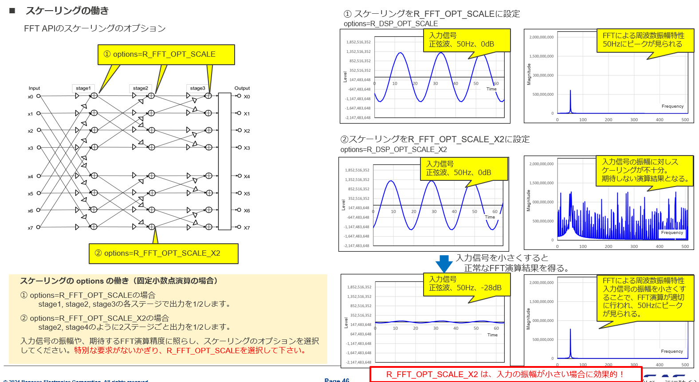

This is an **FFT handle data structure** (dsp_fft_t).
```c
typedef struct
{
    uint16_t n;       // number of points in the transform
    uint16_t options; // calculation options
    void * twiddles;  // twiddle factors
    void * bitrev;    // bit-reverse LUT
    void * work;      // working area
    void * window;    // window coefficients
} dsp_fft_t;
```

# n
```c
uint16_t n;
```
FFT length (number of samples).

Examples:

- n = 256
- n = 512
- n = 1024
- n = 2048

# options
```c
uint16_t options;
```
Controls FFT behavior.

Common options may include:

- Forward FFT
- Inverse FFT (IFFT)
- Real FFT
- Complex FFT
- Scaling enabled/disabled
- Window enabled/disabled

## Scaling
In a radix-2 FFT, each butterfly performs additions:

$a+b,\quad a-b$

The addition can increase the magnitude by up to 2×.

For an N-point FFT: $\log_2(N)$ stages are required.

If you don't scale, the internal values can grow by approximately: $N$ times.

For example, an 8-point FFT:

- stage1: potentially ×2
- stage2: potentially ×2
- stage3: potentially ×2

Total worst-case growth: $2^3 = 8$



The slide means:
- after stage1 → divide by 2
- after stage2 → divide by 2
- after stage3 → divide by 2

Total scaling: $\frac12 \times \frac12 \times \frac12 = \frac18$

which exactly compensates for the worst-case growth of an 8-point FFT.

So **overflow is very unlikely**.

### Why less scaling is better for small signals?
Because fixed-point arithmetic has finite resolution.

Consider a 16-bit FFT. Suppose your input amplitude is only: $100$ LSBs.

With *R_FFT_OPT_SCALE*:
```
100 -> 50 -> 25 -> 12
```
After several stages, lots of low bits disappear due to rounding/truncation.

The FFT starts **losing precision**.

With *R_FFT_OPT_SCALE_X2*:
```
100 -> 100 -> 50 -> 50
```
Values remain larger internally.

Therefore:

- fewer quantization errors
- stronger FFT peaks
- better detection of weak tones

# twiddles
```c
void *twiddles;
```
Pointer to the twiddle factor table.

A twiddle factor is $W_N^k=e^{-j\frac{2\pi k}{N}}$​

Example for N = 8: $W_8^1=e^{-j\pi/4}=0.7071−j0.7071$

Instead of calculating sin/cos every time, the FFT library stores them in a lookup table:
```
twiddles -> {
    W8^0,
    W8^1,
    W8^2,
    ...
}
```

# bitrev
```c
void *bitrev;
```
Pointer to the bit-reversal lookup table (LUT).

FFT rearranges data into bit-reversed order.

For an 8-point FFT:

Normal indices:
```
0 1 2 3 4 5 6 7
```
Binary:
```
000
001
010
011
100
101
110
111
```
Reverse the bits:
```
000 -> 000 -> 0
001 -> 100 -> 4
010 -> 010 -> 2
011 -> 110 -> 6
100 -> 001 -> 1
101 -> 101 -> 5
110 -> 011 -> 3
111 -> 111 -> 7
```
Result:
```
0 4 2 6 1 5 3 7
```
The table may be stored as:
```
bitrev[] =
{
    0,4,2,6,1,5,3,7
};
```
Then the FFT can quickly reorder input samples.

# work
```c
void *work;
```
Temporary workspace memory.

FFT needs storage for intermediate butterfly calculations.

For example:
```
stage1 results
stage2 results
stage3 results
```
may be placed in:
```
work
```

# window
```c
void *window;
```
Window coefficients.

Before FFT, signals are often multiplied by a window:

$x_w[n]=x[n]w[n]$

where $w[n]$ could be:

- Hanning window
- Hamming window
- Blackman window
- Kaiser window

