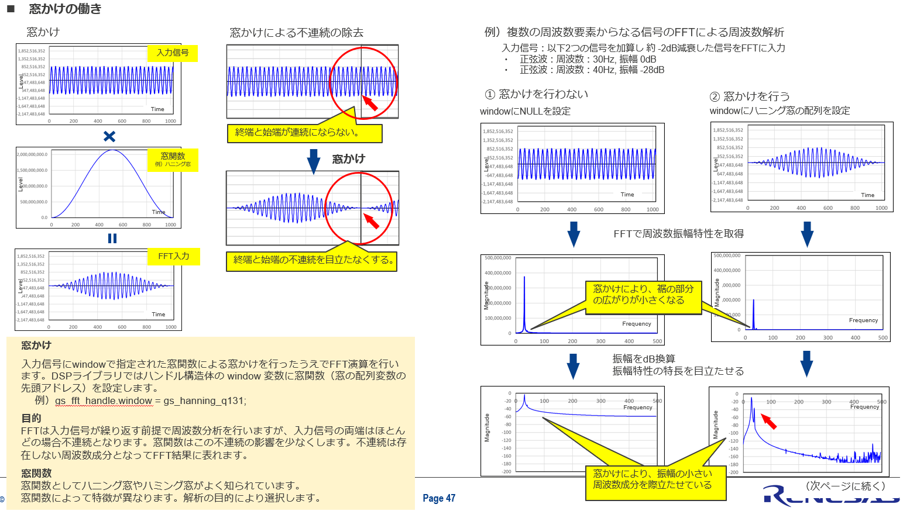

This is an **FFT handle data structure** (dsp_fft_t).
```c
typedef struct
{
    uint16_t n;       // number of points in the transform
    uint16_t options; // calculation options
    void * twiddles;  // twiddle factors
    void * bitrev;    // bit-reverse LUT
    void * work;      // working area
    void * window;    // window coefficients
} dsp_fft_t;
```

# n
```c
uint16_t n;
```
FFT length (number of samples).

Examples:

- n = 256
- n = 512
- n = 1024
- n = 2048

# options
```c
uint16_t options;
```
Controls FFT behavior.

Common options may include:

- Forward FFT
- Inverse FFT (IFFT)
- Real FFT
- Complex FFT
- Scaling enabled/disabled
- Window enabled/disabled

## Scaling
In a radix-2 FFT, each butterfly performs additions:

$a+b,\quad a-b$

The addition can increase the magnitude by up to 2×.

For an N-point FFT: $\log_2(N)$ stages are required.

If you don't scale, the internal values can grow by approximately: $N$ times.

For example, an 8-point FFT:

- stage1: potentially ×2
- stage2: potentially ×2
- stage3: potentially ×2

Total worst-case growth: $2^3 = 8$


The slide means:
- after stage1 → divide by 2
- after stage2 → divide by 2
- after stage3 → divide by 2

Total scaling: $\frac12 \times \frac12 \times \frac12 = \frac18$

which exactly compensates for the worst-case growth of an 8-point FFT.

So **overflow is very unlikely**.

### Why less scaling is better for small signals?
Because fixed-point arithmetic has finite resolution.

Consider a 16-bit FFT. Suppose your input amplitude is only: $100$ LSBs.

With *R_FFT_OPT_SCALE*:
```
100 -> 50 -> 25 -> 12
```
After several stages, lots of low bits disappear due to rounding/truncation.

The FFT starts **losing precision**.

With *R_FFT_OPT_SCALE_X2*:
```
100 -> 100 -> 50 -> 50
```
Values remain larger internally.

Therefore:

- fewer quantization errors
- stronger FFT peaks
- better detection of weak tones

# twiddles
```c
void *twiddles;
```
Pointer to the twiddle factor table.

A twiddle factor is $W_N^k=e^{-j\frac{2\pi k}{N}}$​

Example for N = 8: $W_8^1=e^{-j\pi/4}=0.7071−j0.7071$

Instead of calculating sin/cos every time, the FFT library stores them in a lookup table:
```
twiddles -> {
    W8^0,
    W8^1,
    W8^2,
    ...
}
```

# bitrev
```c
void *bitrev;
```
Pointer to the bit-reversal lookup table (LUT).

FFT rearranges data into bit-reversed order.

For an 8-point FFT:

Normal indices:
```
0 1 2 3 4 5 6 7
```
Binary:
```
000
001
010
011
100
101
110
111
```
Reverse the bits:
```
000 -> 000 -> 0
001 -> 100 -> 4
010 -> 010 -> 2
011 -> 110 -> 6
100 -> 001 -> 1
101 -> 101 -> 5
110 -> 011 -> 3
111 -> 111 -> 7
```
Result:
```
0 4 2 6 1 5 3 7
```
The table may be stored as:
```
bitrev[] =
{
    0,4,2,6,1,5,3,7
};
```
Then the FFT can quickly reorder input samples.

# work
```c
void *work;
```
Temporary workspace memory.

FFT needs storage for intermediate butterfly calculations.

For example:
```
stage1 results
stage2 results
stage3 results
```
may be placed in:
```
work
```

# window
```c
void *window;
```
Window coefficients.

Before FFT, signals are often multiplied by a window:

$x_w[n]=x[n]w[n]$

where $w[n]$ could be:

- Hanning window
- Hamming window
- Blackman window
- Kaiser window

## Why do we need a window?
FFT assumes that the input block **repeats forever**.
```
One frame: x[0] ... x[1023]
```

For example, if you take 1024 samples of a sine wave and feed them directly to the FFT, the FFT internally treats the signal like this:
```
[one FFT frame][same frame][same frame]...
　　　　　　　　　　↓
x[0] ... x[1023] x[0] ... x[1023] x[0] ...
```

So the FFT implicitly connects:
```
x[1023] --> x[0]
```

### Example 1: Integer number of cycles

Suppose Fs = 1024 Hz and your signal is exactly 32 Hz.

Then in 1024 samples you get exactly 32 cycles. The first and last samples line up nicely.

There is almost **no jump**. This is the ideal case.

### Example 2: Non-bin-centered frequency

Now suppose the frequency is 32.5 Hz.

Inside the 1024-sample frame: The signal stops in the middle of a cycle.

So the repeated signal contains **a sudden discontinuity**.

### Why does a discontinuity cause leakage?

A sudden jump requires many frequency components to describe.

Think of a square wave:
```
____|‾‾‾‾
```
A square wave contains lots of harmonics.

Similarly, the artificial jump between $x[1023]$ and $x[0]$ creates extra spectral content.

The FFT interprets that jump as real signal energy and spreads energy into neighboring bins.

This is **spectral leakage**.

For $N=1024$:

- Bin 0 = DC
- Bin 1 = 1 cycle in 1024 samples
- Bin 2 = 2 cycles in 1024 samples
- ...
- Bin 100 = 100 cycles in 1024 samples

Every frequency detector completes an integer number of cycles inside the frame.

Example, bin 3:
```
|<---- 1024 samples ---->|
~~~ cycle 1 ~~~
~~~ cycle 2 ~~~
~~~ cycle 3 ~~~
```
The start and end connect perfectly.

Now suppose your signal is 3.25 cycles over the frame.

There is no frequency detector corresponding to 3.25 cycles, it only has 3 cycles and 4 cycles available. 

So the FFT expresses the signal as a combination:

```
3-bin + 4-bin + 5-bin + ...
```
which appears as spectral leakage.



## What does the window do?
The slide uses a Hanning (Hann) window.

A Hann window gradually reduces the amplitude to nearly zero at both ends.

The start and end become small, so when FFT assumes repetition, **the discontinuity is much less noticeable**.

## What problem does it solve?
It reduces spectral leakage (スペクトルリーケージ).

Suppose the signal contains:

- 30 Hz sine wave at 0 dB
- 40 Hz sine wave at -28 dB

### Without windowing
The strong 30 Hz tone leaks energy into neighboring bins. 

The "skirts" (裾, suso) become wide.

The small -28 dB tone can be hidden under those skirts.

### With windowing
The side lobes are greatly reduced. The main lobe widened a little.

Now the weak 40 Hz component becomes visible.

The red arrow in the bottom-right FFT plot points to the weaker spectral component that becomes easier to detect.

## Trade-off
Windowing is **not free**. Windowing **does** affect frequency detection.

Suppose your signal is: $x[n]$ and you apply a Hann window: $w[n]$

The FFT sees: $x_w[n] = x[n]w[n]$, not the original signal. So you have definitely modified the signal.

A fundamental Fourier property is: 

$x[n]w[n]$ in the time domain corresponds to $X(f) * W(f)$ in the frequency domain.

The $*$ means **convolution**.

In words: Multiplying by a window **smears** the spectrum with the spectrum of the window.

So windowing itself introduces **distortion**.

### What exactly gets worse?

A Hann window causes:

#### Reduced amplitude

A pure tone's FFT magnitude becomes smaller.

For Hann: $\text{coherent gain} \approx 0.5$

which is why many FFT tools compensate for window gain.

#### Wider main lobe

Two close frequencies become harder to separate.

Example:
```
30 Hz
31 Hz
```
The peaks widen and may merge.

Frequency resolution decreases slightly.

So Windowing does **not preserve** the spectrum perfectly.

It deliberately trades:

- Less leakage ✅
- Better weak-tone detection ✅

for

- Wider peaks
- Some amplitude error
- Slightly worse frequency resolution

| No Window                        | Hann Window                         |
| -------------------------------- | ----------------------------------- |
| Better frequency resolution      | Slightly worse frequency resolution |
| More spectral leakage            | Much less leakage                   |
| Strong tones can mask weak tones | Weak tones easier to see            |

In FFT analysis, reducing leakage is usually worth the slight loss in resolution.
