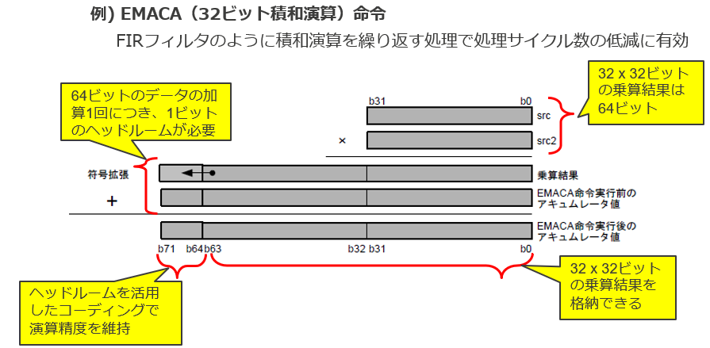

# Multiply-Accumulate (MAC)
Many DSP algorithms repeatedly compute: $Accumulator = Accumulator + (x \times h)$

For example, an FIR filter: $y[n] = \sum_{k=0}^{N-1} h[k]x[n-k]$ requires many multiply-and-add operations.

Instead of:

- Multiply
- Store result
- Add to accumulator

the CPU provides a single **MAC instruction** that does both at once.



The operation being performed is: $ACC_{new}=ACC_{old}+src\times src2$

where:
- src = first 32-bit operand
- src2 = second 32-bit operand
- ACC = accumulator register

# Multiplication of signed 32-bit integers
For signed 32-bit integers, the product of two 32-bit numbers **always fits in 64 bits**, including the sign.

A signed 32-bit integer ranges from $-2^{31} \le x \le 2^{31}-1$

The largest possible magnitude of a product is approximately $(2^{31})(2^{31}) = 2^{62}$

A signed 64-bit integer can represent $-2^{63} \le y \le 2^{63}-1$

Since $2^{62} < 2^{63}$, the product always fits within a signed 64-bit value.

# Why sign extension bits are needed?
The extra bits are not needed for a single multiplication result.

They are needed for **repeated accumulation**:

$ACC = p_1+p_2+p_3+\cdots+p_N$​

where each $p_i$​ is already a 64-bit product.

For example:
```
64-bit product #1
+64-bit product #2
+64-bit product #3
...
```
The accumulator is wider than 64 bits so that filters can sum many products **without overflowing**.

For a signed 32×32 multiplication: $p = a \times b$, the product fits in 64 bits.

Suppose every product is close to the maximum value: $p \approx 2^{62}$

Then after adding $N$ products: $ACC \approx N \cdot 2^{62}$

To store this without overflow: $\log_2(N)$ extra bits are needed.

Examples:
| Number of terms $N$ | Extra bits needed |
| --------------------- | ----------------- |
| 2                     | 1                 |
| 4                     | 2                 |
| 16                    | 4                 |
| 64                    | 6                 |
| 256                   | 8                 |


So an accumulator with **8 extra bits** can theoretically accommodate approximately: $2^8 = 256$ full-scale products before overflowing.

This is why DSP documents often call those upper bits **headroom bits**.

## FIR filter interpretation

Imagine an FIR filter: $y[n] = \sum_{k=0}^{127} h[k]x[n-k]$ with 128 taps.

In the worst case, the accumulator may need roughly: $\log_2(128)=7$ additional bits.

An 8-bit headroom comfortably covers that.

That's why many DSPs provide wider accumulators than multipliers:

- TI DSPs often use 40-bit accumulators for 16-bit arithmetic.
- Some Motorola DSPs use 56-bit accumulators for 24-bit arithmetic.
- This RX DSP uses a 72-bit accumulator for 32-bit arithmetic.

The common idea is:

Make the accumulator a little wider so long sequences of MAC operations can be performed before scaling or saturation becomes necessary.
