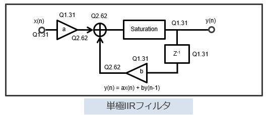
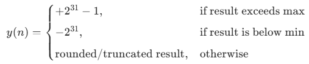

# Fixed-point number formats
Q1.31 and Q2.62 are fixed-point number formats. The notation is: $Qm.n$

where:

- $m$ = number of integer bits (including the sign bit in many DSP conventions)
- $n$ = number of fractional bits
- Total bits = $m+n$

## Q1.31

- 1 sign/integer bit
- 31 fractional bits
- Total = 32 bits

### Range

The smallest step is: $2^{-31}$

The range is: $-1 \le x \le 1-2^{-31}$

Approximately: $-1 \le x \le 0.9999999995$

### Examples
| Decimal | Q1.31 value                   |
| ------- | ----------------------------- |
| 0.5     | 0x40000000                    |
| 0.25    | 0x20000000                    |
| -0.5    | 0xC0000000                    |
| 1.0     | cannot be represented exactly |

For example: $0.5 = 2^{-1}$

$\text{real value}=\frac{\text{stored integer}}{2^{31}}$​

so its binary form is

```
01000000000000000000000000000000
```

the real value becomes:
```
0.1000000000000000000000000000000
```

### Why DSP engineers like Q1.31
Most filter coefficients satisfy $|a|<1$

so Q1.31 gives:

- excellent precision (31 fractional bits)
- convenient 32-bit storage
- efficient implementation on CPUs/DSPs

## Q2.62
### Bit growth
```
Q1.31 × Q1.31 = Q2.62
```
because:
- integer bits: $1+1=2$
- fractional bits: $31+31=62$

### Example

Take: $0.5$ in Q1.31:
```
0x40000000
```
Multiply by itself: $0.25$

The processor actually computes:
```
0x40000000 × 0x40000000 = 0x1000000000000000
```
That 64-bit result is interpreted as a Q2.62 number.

- 1 sign/integer bit + 1 integer bit
- 62 fractional bits
- Total = 64 bits

### Why convert back to Q1.31?
The delay element stores: $y(n-1)$

If we kept Q2.62 everywhere:

- memory doubles
- computation cost increases

Therefore DSP implementations usually:

- Compute in Q2.62
- **Round/truncate** to Q1.31
- **Saturate** if necessary
- Store as Q1.31

### How to convert back to Q1.31?
**Right shift by 31 bits**.

Suppose the 64-bit integer is $N$.

After arithmetic right-shift by 31: $N' = N >> 31$

The new value is: $N' \approx \frac{N}{2^{31}}$​

(the fractional part is discarded because of integer truncation).

Now interpret $N'$ as a **Q1.31** number: $\text{real value after conversion} = \frac{N'}{2^{31}}$

Substituting: $\frac{N/2^{31}}{2^{31}} = \frac{N}{2^{62}}$​

which is exactly the original real value.

So the purpose of the shift is **not to change the real-world value**, but to **change the Q format**.

# Saturation
Saturation prevents the result from exceeding the range that can be represented by the output format.

A signed Q1.31 number can represent approximately: $-1.0 \le x < 1.0$

More precisely: $-1 \le x \le 0.9999999995$

Suppose the accumulator produces: $1.25$

This cannot be represented in Q1.31.

## Without saturation
If you simply truncate the higher bits, the value may wrap around due to 2's complement arithmetic:
```
1.25 --> overflow --> negative number
```
That incorrect value may be fed back into the filter and affects all future outputs.

This creates large **distortion** and can even make an IIR filter **unstable**.

## With saturation
Instead of wrapping around, the value is clipped to the maximum representable value:

$\text{saturate}(1.25)=0.9999999995$

Similarly, $\text{saturate}(-1.4)=-1.0$

Graphically:
```
Input       Output
1.4  ------> 1.0
1.0  ------> 1.0
0.5  ------> 0.5
0    ------> 0
-0.5 ------> -0.5
-1.0 ------> -1.0
-1.6 ------> -1.0
```

## In DSP hardware
The saturation block typically performs:



So any value outside the Q1.31 range is **clipped to the nearest representable limit** rather than allowed to overflow and wrap around.

# Rounding
When two Q1.31 numbers are multiplied: $Q1.31 \times Q1.31 \rightarrow Q2.62$

Example:
```
0.7 × 0.7 = 0.49
```
Internally, the DSP stores the result with 62 fractional bits:
```
0.490000000000...
```
But eventually the filter output must return to Q1.31 format, which only has 31 fractional bits.

So the DSP must **discard** 31 bits.

## Without rounding (truncation)
Suppose the true value is:
```
1.23456789
```
If only a few decimal places are kept:
```
1.2345
```
The extra digits are simply thrown away.

This is called **truncation** (cutting off).

The result is always slightly smaller than the true value.

## With rounding
Instead of simply throwing away the bits, the DSP checks the first discarded bit:
```
1.23456 → 1.2346
1.23454 → 1.2345
```
In binary:
```
Kept bits  Discarded bits
10110011 | 100101...
```
Because the first discarded bit is 1, the DSP rounds up:
```
10110100
```
instead of
```
10110011
```

## Why this matters in IIR filters
An IIR filter performs millions of multiply-accumulate operations:

$y[n] = b_0x[n]+b_1x[n-1]+b_2x[n-2] -a_1y[n-1]-a_2y[n-2]$

Each multiplication produces a high-precision result (for example Q2.62).

If every result is truncated:
```
small error
   ↓
feedback
   ↓
more error
   ↓
accumulates
```
The error can accumulate because previous outputs are fed back into future calculations.

Using rounding makes **the quantization error much smaller and more unbiased**.

